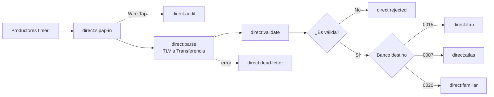
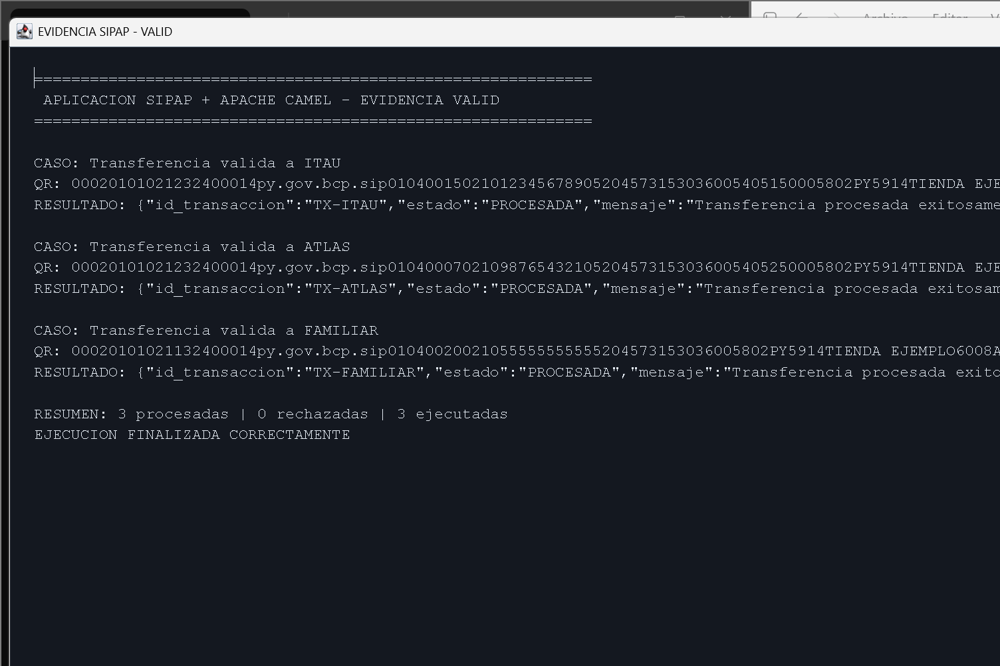

# Tarea 1 - Integración SIPAP con Apache Camel

**Alumno:** Esteban Gavilan
**Tema:** Transferencias QR SIPAP usando Apache Camel

## Descripción

En esta tarea hice una simulación de transferencias entre bancos usando Apache Camel. La idea es que un productor genera una cadena QR en formato TLV, Camel la recibe, la valida, la transforma a un modelo JSON y la manda al banco correspondiente.

Los bancos simulados son:

- ITAU (`0015`)
- ATLAS (`0007`)
- FAMILIAR (`0020`)

Todo se comunica dentro del mismo proceso con endpoints `direct:`. No se usó ActiveMQ, Artemis ni ningún otro broker.

> El QR y el checksum `A1B2` son solamente para esta práctica. No deben usarse en transferencias reales.

## Requisitos

- Java 17 o superior.
- Maven 3.9 o superior.

## Cómo ejecutar

Primero se compila y se ejecutan las pruebas:

```bash
mvn clean test
```

Para levantar la aplicación principal:

```bash
mvn exec:java
```

La aplicación genera transferencias para ITAU, ATLAS y FAMILIAR mediante productores `timer:`.

## Estructura del proyecto

```text
src/main/java/py/edu/ucom/sipap/
├── SipapApplication.java       inicio de la aplicación
├── routes/                     rutas de Apache Camel
├── tlv/                        parser y codec TLV
├── domain/                     clases del modelo canónico
├── validation/                 validaciones de la transferencia
├── processor/                  consumidores, rechazos y correlación
└── samples/                    ejemplos de QR

src/test/java/                  pruebas automatizadas
examples/                       QR válidos e inválidos
evidencias/                     capturas y resultado de pruebas
docs/                           diagrama del flujo
```

## Flujo realizado



## Formato del QR

La cadena usa el formato `TAG + LONGITUD + VALOR`.

Ejemplo de una transferencia válida para ITAU:

```text
00020101021232400014py.gov.bcp.sip01040015021012345678905204573153036005405150005802PY5914TIENDA EJEMPLO6008ASUNCION6304A1B2
```

El tag `32` contiene la información de cuenta:

| Sub-tag | Contenido |
|---|---|
| `00` | `py.gov.bcp.sip` |
| `01` | Código del banco |
| `02` | Número de cuenta |

Todos los ejemplos válidos e inválidos están en [examples/cadenas-qr.txt](examples/cadenas-qr.txt).

## Modelo canónico

Después de leer el QR, los consumidores reciben este JSON y no la cadena TLV original:

```json
{
  "payload_format_indicator": "01",
  "point_of_initiation_method": "12",
  "merchant_account_information": {
    "globally_unique_identifier": "py.gov.bcp.sip",
    "codigo_entidad": "0015",
    "numero_cuenta": "1234567890"
  },
  "transaction_currency": "600",
  "transaction_amount": 15000,
  "merchant_name": "TIENDA EJEMPLO",
  "crc": "A1B2"
}
```

## Validaciones implementadas

Se valida que:

- La estructura TLV y sus longitudes sean correctas.
- Estén presentes los campos obligatorios.
- El identificador sea `py.gov.bcp.sip`.
- El banco exista dentro de los bancos simulados.
- La moneda sea `600` (PYG).
- Un QR dinámico tenga un monto positivo.
- El monto sea menor a G. 10.000.000, como pide la consigna.
- El checksum sea `A1B2`.

Si algo falla, el mensaje no llega al banco y se devuelve un resultado con estado `RECHAZADA`.

## Patrones EIP usados

| Patrón | Cómo lo usé |
|---|---|
| Message Channel | Los canales `direct:sipap-in`, `direct:itau`, `direct:atlas` y `direct:familiar`. |
| Pipes and Filters | Separé el flujo en recepción, parseo, validación y procesamiento. |
| Message Translator | `QrParser` transforma el QR TLV al objeto `Transferencia`. |
| Content-Based Router | `choice()` elige el banco según el código de entidad. |
| Message Filter | Los QR inválidos se rechazan antes de llegar a un banco. |
| Correlation Identifier | Se conserva el id de transacción en `SipapTransactionId`. |
| Dead Letter Channel | Captura errores de parsing y los convierte en un rechazo. |
| Wire Tap | Guarda una copia de auditoría sin cambiar el flujo principal. |

## Pruebas

Para ejecutar las pruebas:

```bash
mvn test
```

Se probaron estos casos:

1. Transferencia válida a ITAU.
2. Transferencia válida a ATLAS.
3. Transferencia válida a FAMILIAR.
4. Banco desconocido.
5. Campo obligatorio ausente.
6. Monto igual a G. 10.000.000.
7. Checksum incorrecto.
8. Longitud TLV incorrecta.

Resultado de las pruebas: **10 pruebas ejecutadas, 0 fallos y 0 errores**.

El detalle está en [evidencias/resultado-pruebas.txt](evidencias/resultado-pruebas.txt).

## Evidencias de ejecución

Además de las pruebas, se ejecutó la aplicación con dos grupos de escenarios.

Para generar las mismas pantallas:

```bash
mvn exec:java -Dexec.mainClass=py.edu.ucom.sipap.SipapEvidenceWindow -Dexec.args=valid
mvn exec:java -Dexec.mainClass=py.edu.ucom.sipap.SipapEvidenceWindow -Dexec.args=invalid
```

### Casos válidos

Se procesaron correctamente una transferencia para ITAU, una para ATLAS y una para FAMILIAR.



### Casos inválidos

Se rechazaron un banco desconocido, un campo obligatorio ausente, un monto límite, un CRC inválido y una cadena TLV incorrecta.


## Referencias consultadas

- [Apache Camel - Direct Component](https://camel.apache.org/components/4.18.x/direct-component.html)
- [Apache Camel - Enterprise Integration Patterns](https://camel.apache.org/components/4.18.x/eips/enterprise-integration-patterns.html)
- [Apache Camel - Testing](https://camel.apache.org/components/4.18.x/others/test.html)
- [EMVCo QR Codes](https://www.emvco.com/emv-technologies/qr-codes/)
