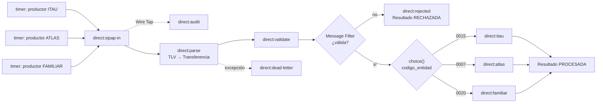

# Integración de transferencias SIPAP mediante QR con Apache Camel

Proyecto académico que simula la recepción, interpretación, validación, transformación y
enrutamiento de transferencias SIP entre ITAU, ATLAS y FAMILIAR. Toda la comunicación ocurre
dentro de un único `CamelContext` mediante endpoints `direct:`; no utiliza ActiveMQ, Artemis ni
otro broker.

> **Alcance didáctico:** las cadenas, los códigos de entidad y el checksum `A1B2` siguen la
> consigna académica. No representan un QR oficial y no deben utilizarse para operaciones reales.

## Requisitos

- Java 17 o 21.
- Maven 3.9 o superior.
- Conexión a internet únicamente en la primera compilación, para descargar dependencias.

El proyecto usa Apache Camel **4.18.4 LTS**. Esta línea es compatible con Java 17 y 21 y fue
publicada como versión LTS por el proyecto Apache Camel.[^1]

## Ejecución

```bash
mvn clean test
mvn exec:java
```

La aplicación levanta tres productores `timer:`. Cada uno genera una transferencia educativa y
la envía a `direct:sipap-in`. Se verán en consola el QR recibido, el modelo canónico y el resultado
común producido por el banco. La aplicación permanece activa hasta presionar `Ctrl+C`.

## Flujo de integración



`direct:` invoca otro endpoint del mismo `CamelContext` de forma directa y síncrona, por lo que
encaja con la restricción de la consigna, aunque no ofrece persistencia ni distribución.[^2]

## Estructura del proyecto

```text
src/main/java/py/edu/ucom/sipap/
├── SipapApplication.java             arranque de Camel Main
├── domain/                           modelo canónico y resultado común
├── processor/                        correlación, consumidores y rechazos
├── routes/SipapRoutes.java           rutas y patrones EIP en Java DSL
├── samples/QrSamples.java            productores de cadenas correctas/incorrectas
├── tlv/                              codec TLV y traductor QR
└── validation/                       reglas funcionales
src/test/java/py/edu/ucom/sipap/      pruebas unitarias y de integración
```

## Procesamiento TLV

`TlvCodec` avanza por la cadena leyendo bloques de cuatro caracteres (`TAG` + `LONGITUD`) y luego
consume exactamente la cantidad declarada. Rechaza cabeceras incompletas, longitudes no numéricas,
valores truncados y tags duplicados. El bloque 32 se vuelve a decodificar para obtener sus sub-tags:

- `00`: `py.gov.bcp.sip`;
- `01`: código de la entidad de destino;
- `02`: número de cuenta.

Las longitudes se generan automáticamente. Por ejemplo, `TIENDA EJEMPLO` tiene 14 caracteres y se
codifica como `5914TIENDA EJEMPLO`. El valor interno completo del tag 32 ocupa 40 caracteres al
contar también las cabeceras de sus tres sub-tags, por eso comienza con `3240`.

EMVCo define un formato estandarizado e interoperable para comunicar datos de pago mediante QR;
este proyecto implementa solamente el subconjunto TLV simplificado exigido por la consigna.[^3]

## Modelo canónico

Los consumidores nunca reciben la cadena original. Reciben una instancia de `Transferencia`, que
Jackson representa así:

```json
{
  "payload_format_indicator": "01",
  "point_of_initiation_method": "12",
  "merchant_account_information": {
    "globally_unique_identifier": "py.gov.bcp.sip",
    "codigo_entidad": "0015",
    "numero_cuenta": "1234567890"
  },
  "merchant_category_code": "5731",
  "transaction_currency": "600",
  "transaction_amount": 15000,
  "country_code": "PY",
  "merchant_name": "TIENDA EJEMPLO",
  "merchant_city": "ASUNCION",
  "crc": "A1B2"
}
```

## Validaciones

La transferencia solo llega a un consumidor si cumple todas estas reglas:

1. Payload Format Indicator igual a `01`.
2. Point of Initiation Method igual a `11` o `12`.
3. Sub-tags `00`, `01` y `02` presentes en Merchant Account Information.
4. Identificador global igual a `py.gov.bcp.sip`.
5. Banco reconocido: `0015`, `0007` o `0020`.
6. Campos obligatorios del comercio presentes.
7. Moneda igual a `600` (PYG).
8. Monto positivo para QR dinámico.
9. Monto menor a G. 10.000.000, conforme al escenario de rechazo de la consigna.
10. Checksum didáctico igual a `A1B2`.

El límite real comunicado por el BCP en 2026 permite operaciones **hasta** G. 10 millones.[^4]
Esta implementación rechaza montos **mayores o iguales** a ese valor porque así lo exige
explícitamente el escenario académico; no intenta reproducir las reglas productivas del SIP.

## Patrones EIP aplicados

| Patrón | Evidencia en el proyecto |
|---|---|
| Message Channel | `direct:sipap-in`, `direct:parse`, `direct:validate`, `direct:itau`, `direct:atlas`, `direct:familiar` |
| Pipes and Filters | Rutas separadas para recepción, parsing, traducción, validación, filtrado y consumo |
| Message Translator | `QrParser` convierte TLV a `Transferencia`; `marshal/unmarshal` evidencia el JSON canónico |
| Content-Based Router | `choice()` selecciona el consumidor según `SipapBankCode` |
| Message Filter | Dos `filter()` separan transferencias válidas y rechazadas antes de los bancos |
| Correlation Identifier | Cabecera `SipapTransactionId`, conservada de extremo a extremo |
| Dead Letter Channel | Errores de parsing terminan en `direct:dead-letter` como resultado `RECHAZADA` |
| Wire Tap | Copia de auditoría hacia `direct:audit` sin alterar el mensaje principal |

Camel implementa estos patrones como procesadores componibles; su catálogo oficial incluye
Content-Based Router, Filter, Splitter, Aggregator y otros patrones de integración.[^5] El Filter
EIP deja continuar únicamente los mensajes cuyo predicado se evalúa como verdadero,[^6] mientras
que Dead Letter Channel mueve fallos agotados a un endpoint dedicado.[^7]

## Resultados comunes

Procesada:

```json
{
  "id_transaccion": "TX000001",
  "estado": "PROCESADA",
  "mensaje": "Transferencia procesada exitosamente por ITAU"
}
```

Rechazada:

```json
{
  "id_transaccion": "TX000002",
  "estado": "RECHAZADA",
  "mensaje": "Checksum inválido: se esperaba A1B2"
}
```

## Pruebas

```bash
mvn test
```

Se incluyen diez pruebas automatizadas, con los siete escenarios mínimos de la consigna:

- ITAU válida;
- ATLAS válida;
- FAMILIAR válida;
- banco desconocido;
- campo obligatorio ausente;
- monto igual a G. 10.000.000;
- checksum incorrecto;
- TLV cuya longitud declarada supera los caracteres disponibles;
- codificación y decodificación correcta de longitudes;
- conversión de un TLV malformado al resultado común mediante Dead Letter Channel.

La última ejecución local obtuvo: **10 pruebas, 0 fallos, 0 errores, 0 omitidas**. El resumen está
en [`evidencias/resultado-pruebas.txt`](evidencias/resultado-pruebas.txt).

## Ejemplos

Las cadenas listas para copiar están en [`examples/cadenas-qr.txt`](examples/cadenas-qr.txt).
También se generan programáticamente con `QrSamples`, evitando errores manuales de longitud.

## Evolución posible

La lógica de TLV, validación y dominio no depende del transporte. En una segunda etapa, los
endpoints `direct:` podrían sustituirse por colas, manteniendo los procesadores. Esa evolución
añadiría persistencia, asincronía y garantías de entrega, pero está deliberadamente fuera del
alcance actual.

## Referencias

[^1]: Apache Camel, [Releases 4.18.x](https://camel.apache.org/releases/) y [descargas/versiones compatibles de Java](https://camel.apache.org/download/).
[^2]: Apache Camel, [Direct Component](https://camel.apache.org/components/4.18.x/direct-component.html).
[^3]: EMVCo, [EMV QR Codes](https://www.emvco.com/emv-technologies/qr-codes/).
[^4]: Banco Central del Paraguay, [actualización del límite del SPI a G. 10 millones](https://www.bcp.gov.py/es/web/institucional/w/bcp-actualiza-el-reglamento-del-sipap-y-eleva-el-limite-de-las-transferencias-instantaneas-a-g-10-millones).
[^5]: Apache Camel, [Enterprise Integration Patterns](https://camel.apache.org/components/4.18.x/eips/enterprise-integration-patterns.html).
[^6]: Apache Camel, [Filter EIP](https://camel.apache.org/components/4.18.x/eips/filter-eip.html).
[^7]: Apache Camel, [Dead Letter Channel](https://camel.apache.org/components/4.18.x/eips/dead-letter-channel.html).
