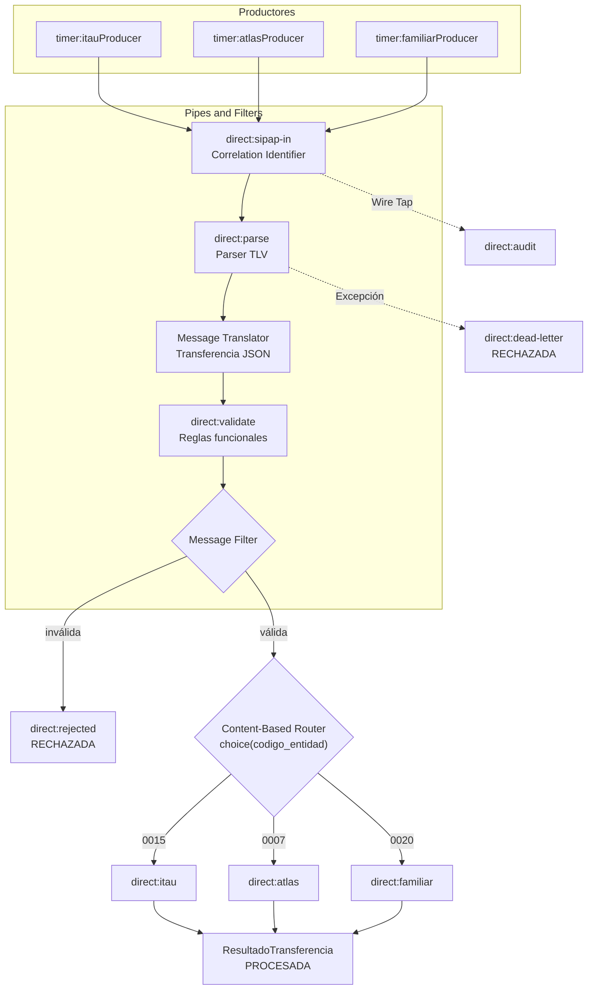

# Diagrama del flujo SIPAP educativo

Todos los canales internos son endpoints `direct:` del mismo `CamelContext`. La auditoría obtiene
una copia mediante Wire Tap y no modifica el intercambio principal.
